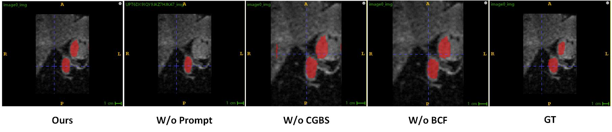
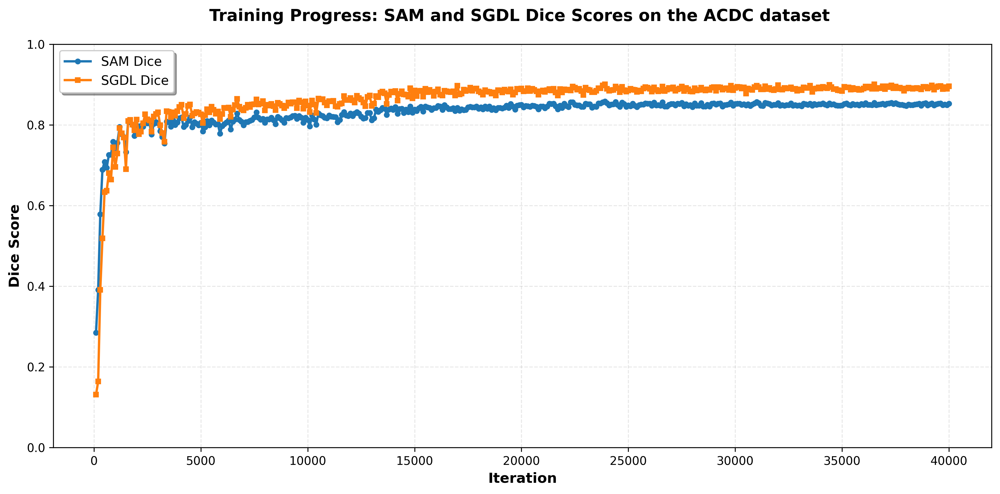

**1.Effect of BFC-Net**

   
  <em>Fig. 1: Visualization of SAM results under different methods on the 10% labeled LA dataset.</em>

   
  <em>Fig. 2: The output of BFC-Net was compared with that obtained by substituting BFC-Net with two parallel U-Net networks, with all other conditions held constant on the 10% labeled LA dataset.</em>

*BFC-Net and SAM are mutually complementary—BFC-Net provides accurate prompts for SAM, while SAM provides high-precision pseudo-labels for BFC-Net.Our approach demonstrates superior boundary delineation and regional accuracy, validating BFC-Net's effectiveness.*

**2.Architecture of MCVT**

   
  <em>Fig. 3: The architecture of MCVT.png.</em>

*MVCT, which stands for multi-view co-training, originates from the paper "Learnable prompting sam-induced knowledge distillation for semi-supervised medical image segmentation". It takes three inputs—a difference map, an uncertainty map, and a prediction map—extracts features from each respectively, and fuses them to generate the output.*

**3.Dice score evolution of SAM and BFC-Net throughout training**

   
  <em>Fig. 4: Evolution of SAM and BFC-Net Dice Scores Across Iterations.</em>

*The plot shows Dice scores of SAM (blue) and BFC-Net (orange) during training on ACDC dataset. SAM quickly rises to ~0.84 with stable convergence, while BFC-Net plateaus near 0.89. BFC-Net significantly outperforms SAM by a final margin of ~0.05, demonstrating superior segmentation efficacy.Our method exhibits stable training without significant fluctuations.*
